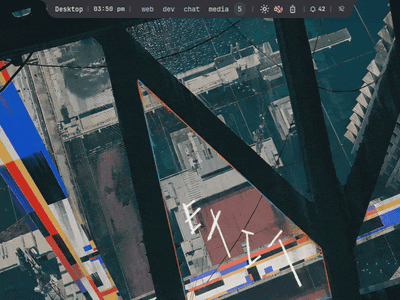
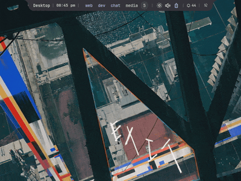
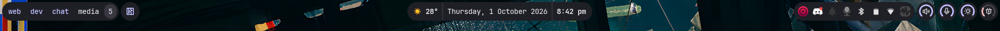
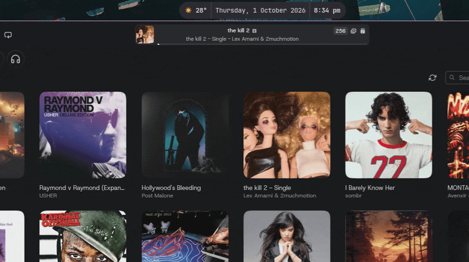
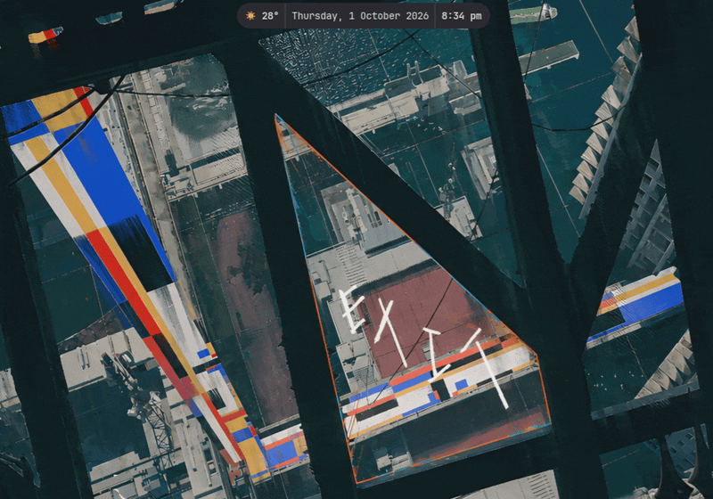
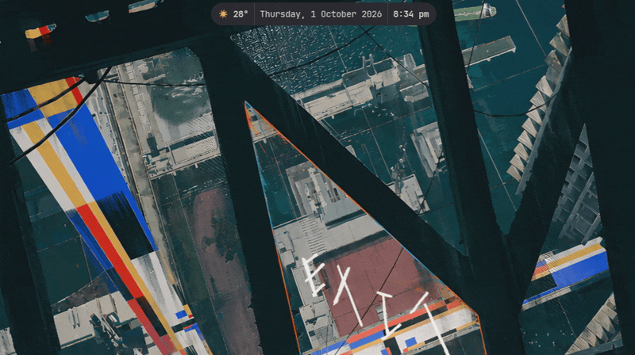
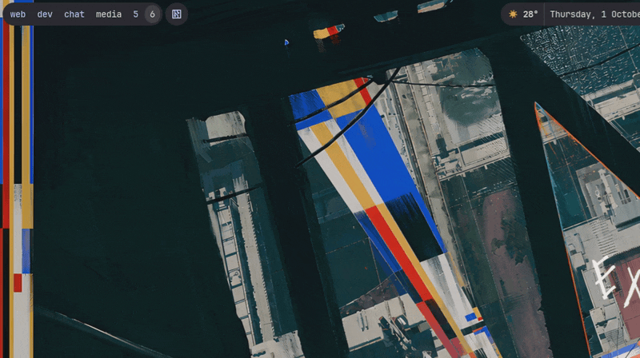
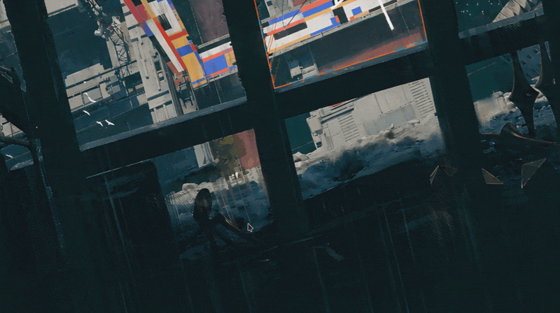
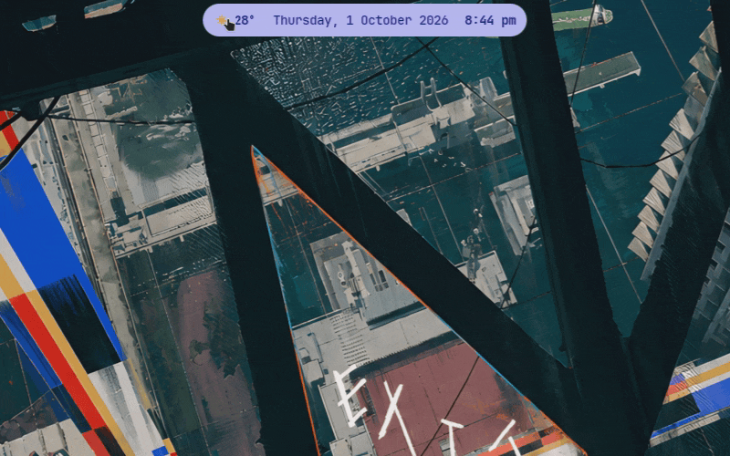
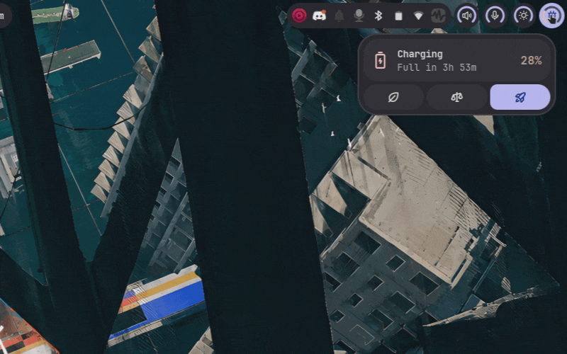

#  Nonchalant Shell

**Nonchalant Shell** is a Niri-first Wayland desktop shell built with
[Quickshell](https://quickshell.org).

## Hard fork

This project is a **hard fork** of
[Ambxst](https://github.com/Axenide/Ambxst) by
[Axenide](https://github.com/Axenide).

It is not Ambxst, does not track Ambxst as an upstream merge target for
day-to-day work, and ships under its own name, branding, config paths, and
release process. The fork keeps a lean runtime focus:

- wallpaper
- one unified bar
- floating run menu
- lockscreen
- reactive JSON configuration

Multi-monitor support uses Quickshell `Variants` on `Quickshell.screens`.

## Features

- Runs directly on [Niri](https://github.com/YaLTeR/niri) via its JSON event stream
- Normalized monitor, workspace, and window state for multi-monitor setups
- Unified bar with workspaces/taskbar, clock, system status, and systray
- Floating run menu and power menu
- Wallpaper picker and secure `WlSessionLock` session lock
- Isolated `nonchalant` config, state, cache, data, and IPC paths

## Showcase

### Island bar


<details>
<summary>View previews</summary>

| | |
|---|---|
| **Launcher** — search and launch apps from the island<br> | **Dashboard** — controls, media and quick toggles<br> |
| **Wallpaper picker**<br> | **System monitor**<br> |
| **Sound**<br> | **Wi-Fi**<br> |
| **Calendar**<br> | **Power menu**<br> |
| **Weather**<br> | **Battery & power profile**<br> |

</details>

### Classic bar



<details>
<summary>View previews</summary>

| | |
|---|---|
| **Launcher**<br> | **Dashboard**<br> |
| **Wallpaper picker**<br> | **System monitor**<br> |
| **Power menu**<br> | **Weather**<br> |
| **Battery & power profile**<br> | |

</details>

## Direct commands

The shell exposes lightweight commands through its IPC runner. For example,
`nonchalant run wallpapers` opens the wallpaper picker on the focused monitor
and toggles it closed when invoked again. This can be bound from Niri with:

```kdl
Mod+Shift+W hotkey-overlay-title="Open Wallpapers" { spawn "nonchalant" "run" "wallpapers"; }
```

## Run the development tree

Install Quickshell and the runtime tools needed by the shell. Install fonts once,
then run from a checkout:

```bash
./scripts/install-fonts.sh
qs -p /path/to/nonchalant-shell
```

Or use the CLI wrapper:

```bash
./cli.sh
```

The installer and Nix package are still inherited scaffolding and may need
adjustment for this fork.

## Attribution and license

Nonchalant Shell is derived from Ambxst by Axenide. Full copyright and
contributor history from that lineage is preserved in this repository’s Git
history.

This project is licensed under the GNU Affero General Public License v3.0 or
later. See [LICENSE](./LICENSE).
